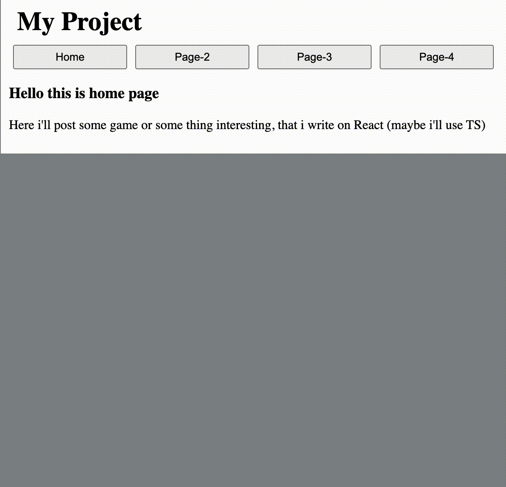

# React web site 

Это сайт для практики по реакту, но теперь у меня есть fullStack проект и не знаю пригодится ли мне этот сайт, но тут я изучил React Router и его же там и использовал, на сайте есть простая реализация фильтра на первой странице, на других пока ничего

---

## 💻 Демонстрация

---

## 🛠️ Технологии

&nbsp;

---

## 🔮 Будущее

Пока туманное, потому что создал FullStack проект, а там у меня как раз есть React, а этот проект создавался для обучения React, но есть один план, сделаю из этого проекта свою лабораторию